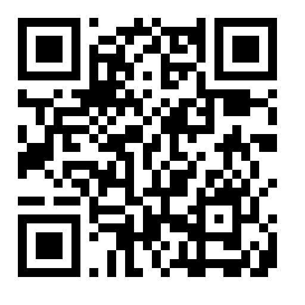

# Hi, I'm Proj Gasi

I work in **information and AI security**, design **IT solutions**, conduct **audits**, and contribute to projects that make AI safer.  
Welcome to my GitHub profile! 

---

## 🎓 Certificates

You can view my learning achievements here:

> PDFs are stored in the `certs/` folder of education repository.

---

## 💻 Projects

Here are some of my recent projects:

- [Project GASI](https://projgasi.github.io/) — Global AI Security Initiative – Protecting AI from Modern Threats.
Collaborative AI Red Team is a SaaS platform for collective AI security.
Companies using AI can securely share discovered threats and vulnerabilities.
The system aggregates these reports and automatically tests all participants against new attack vectors.
The result — shared resilience, faster mitigation, and a global red team for AI defense. 

---

## 💰 Support Our Project

Help us make AI safer by contributing!  
Send funds to the wallets below:

| Coin | Address | QR Code |
|------|---------|---------|
| BTC | bc1q5uw5vx2fzg909ltam62re9mugulq73cu0v3u9m |  |
| ETH/ERC-20 (USDT, USDC, DAI) | 0x3DE31F812020B45D93750Be4Bc55D51c52375666 |  |

---

## 📫 Contact

- Email: [projgasi@proton.me](mailto:projgasi@proton.me)  
- GitHub: [projgasi](https://github.com/projgasi)

---

*“The future is not set. There is no fate but what we make for ourselves.” — Terminator*
